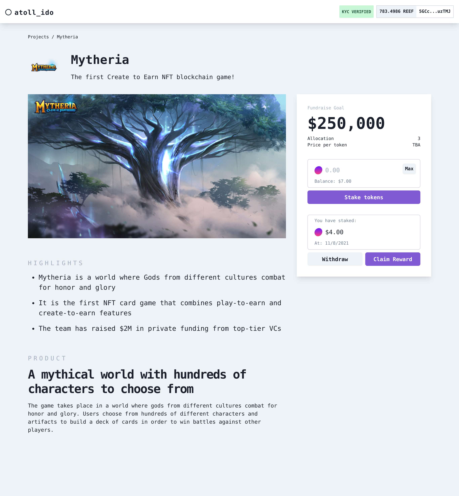

# Atoll IDO

IDO launchpad built for DeFi & Cross-Chain Interoperability Hackathon.



_(Uses data from [Polkastarter](https://polkastarter.com/))_

### Works like this:

- Project applies for IDO (this could go through governance voting)
- IDO contract is deployed for project
  - Token vesting so owner can only withdraw in increments
- API is called to create project on backend (mocked in data.js)
- User connects wallet
- KYC check with Stripe Identity
- User can transfer tokens to project IDO contract
  - Can only withdraw after locktime
- User can claim reward tokens

Wasn't able to finish in time so some features are not implemented yet.

### Features

- Connect wallet with Polkadot extension
- KYC with Stripe Identity
- SmartContract with token vesting

---

- Demo: https://atoll-ido.web.app
- Video: https://www.loom.com/share/c45cd1772b934431a32cca01db255781

#### Created as a submission to DeFi & Cross-Chain Interoperability Hackathon

- Link:
  https://gitcoin.co/issue/reef-defi/reef-finance-bounties/3/100026840

## Getting Started

First, run the development server:

```bash
npm run dev
# or
yarn dev
```

Open [http://localhost:3000](http://localhost:3000) with your browser to see the result.

#### Start the http api emulator

```bash
cd functions
npm run serve
```

API is now available at: http://localhost:5001/atoll-ido/us-central1/api
